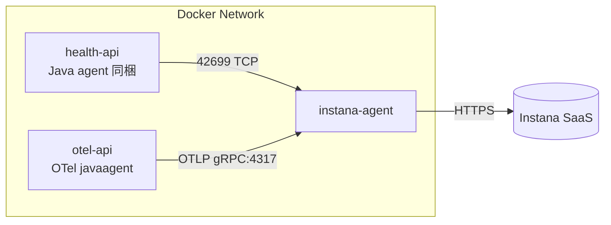

# hello-instana

## 構成

- `instana-agent`: Instana Agent コンテナ（APM + OTLP 受信）。`INSTANA_AGENT_ENDPOINT`/`KEY` は `.env` で指定。
- `health-api`: Spring Boot 簡易ヘルス API。Instana Java agent を同梱して Instana Agent 経由で送信。`/health` が 200 OK。
- `otel-api`: Spring Boot 簡易ヘルス API。OpenTelemetry Java auto-instrumentation (v1.33.0) で起動し、OTLP gRPC で Instana Agent (`http://instana-agent:4317`) に送信。`/health` が 200 OK。

## 使い方

1. `.env` に Instana のキーとエンドポイントを設定。
2. `docker compose up -d` で全コンテナ起動。
   - 個別: `docker compose up -d instana-agent health-api otel-api`
3. 動作確認:
   - `curl http://localhost:8080/health` (health-api)
   - `curl http://localhost:8081/health` (otel-api)
4. ログ:
   - `docker compose logs -f instana-agent`
   - `docker compose logs -f health-api`
   - `docker compose logs -f otel-api`
